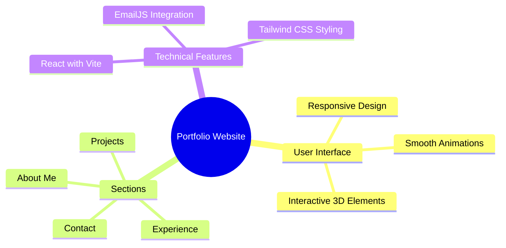

<div align="center">


<p align="center">
  <a href="#features">Features</a> •
  <a href="#demo">Demo</a> •
  <a href="#screenshots">Screenshots</a> •
  <a href="#installation">Installation</a> •
  <a href="#tech-stack">Tech Stack</a>
</p>

[](LICENSE)
[](https://pranay-portfolio.vercel.app)
[](https://reactjs.org)

<p align="center">
A modern, responsive portfolio website showcasing professional experience, projects, and skills. Built with React, Vite, and Tailwind CSS, featuring smooth animations and interactive 3D elements. ✨
</p>

</div>

## ✨ Features

<div align="center">



</div>

## 🚀 Demo

Experience the live portfolio at [https://pranay-portfolio.vercel.app](https://pranay-portfolio.vercel.app)

## 🛠️ Installation

1️⃣ **Clone the repository:**
```bash
git clone https://github.com/mudigondapranay/pranay-portfolio
```

2️⃣ **Navigate to project directory:**
```bash
cd pranay-portfolio
```

3️⃣ **Install dependencies:**
```bash
npm install
```

4️⃣ **Run development server:**
```bash
npm run dev
```

5️⃣ **Open in browser:**
- Visit [http://localhost:3000](http://localhost:3000)

## 💻 Tech Stack

| | | | |
|:---:|:---:|:---:|:---:|
|  <br> React |  <br> Vite |  <br> Tailwind CSS |  <br> Three.js |

## ⚡ Core Features

- 📱 **Responsive Design**
  - Mobile-first approach
  - Seamless experience across all devices
  - Adaptive layouts and components

- 🎯 **Dynamic Content**
  - Interactive project showcase
  - Engaging experience section
  - Animated skill representations

- 🎨 **Modern UI/UX**
  - Smooth Framer Motion animations
  - Intuitive navigation
  - Clean and professional design
  - Interactive 3D elements using Three.js

- ✉️ **Email Integration**
  - Contact form using EmailJS

## 📄 License

MIT License © [Pranay](LICENSE)

---

<div align="center">


</div>
