<div align="center">


[](https://git.io/typing-svg)

</div>

---

<div align="center">

### 🚀 **[EXPLORE PRANAY'S PORTFOLIO]((https://mudigondapranay.github.io/pranay-portfolio/))** | 💎 **[FEATURES](#-next-gen-features)** | 🛠️ **[TECH STACK](#-quantum-tech-stack)** | ⚡ **[INSTALLATION](#-lightning-fast-setup)**

[](LICENSE)
[]((https://mudigondapranay.github.io/pranay-portfolio/))
[](https://reactjs.org)
[](https://vitejs.dev)

</div>

---

## 🌟 **PRANAY'S VISION**

> *"In the intersection of creativity and code, I architect digital experiences that don't just function—they inspire."*

**Welcome to Pranay's Digital Ecosystem** - A next-generation portfolio that transcends traditional boundaries. This isn't just a website; it's a testament to innovation, a showcase of cutting-edge development, and a window into the future of web experiences.

**🎯 Mission:** To push the boundaries of what's possible in web development while creating meaningful, user-centric digital solutions.

---

## 🔮 **NEXT-GEN FEATURES**

```mermaid
mindmap
  root((PRANAY'S
    PORTFOLIO
    ECOSYSTEM))
    🎨 IMMERSIVE UI
      ✨ Micro-Interactions
      🌊 Fluid Animations
      🎭 3D Visual Elements
      📱 Responsive Perfection
    🚀 PERFORMANCE
      ⚡ Lightning Load Times
      🔄 Smooth Transitions
      📈 Optimized Rendering
      🎯 SEO Excellence
    🛠️ ARCHITECTURE
      ⚛️ React 18+ Features
      🔥 Vite Build System
      🎨 Tailwind CSS
      📧 Smart Contact Forms
    🌐 EXPERIENCE
      👤 Personal Branding
      💼 Project Showcases
      📊 Skill Visualization
      🤝 Interactive Contact
```

<div align="center">



</div>

### **🎨 IMMERSIVE USER EXPERIENCE**

| Feature | Pranay's Innovation |
|---------|-------------------|
| **🌊 Fluid Animations** | Crafted with Framer Motion for buttery-smooth 60fps experiences |
| **🎭 3D Interactive Elements** | Three.js powered visuals that respond to user interaction |
| **📱 Adaptive Design** | Mobile-first architecture that scales beautifully across all devices |
| **✨ Micro-Interactions** | Every click, hover, and scroll tells a story |
| **🎯 Performance Optimized** | Sub-second load times with intelligent code splitting |

### **🚀 TECHNICAL EXCELLENCE**

- **⚡ Lightning-Fast Performance:** Vite-powered development with optimized production builds
- **🔧 Modern React Patterns:** Hooks, Context, and latest React 18+ features
- **🎨 Tailwind CSS Mastery:** Utility-first styling with custom design system
- **📧 Smart Communication:** EmailJS integration for seamless contact functionality
- **🔍 SEO Optimized:** Structured data and meta optimization for discoverability

---

## 🌐 **EXPERIENCE PRANAY'S UNIVERSE**

<div align="center">

### **[🚀 LAUNCH PORTFOLIO](https://mudigondapranay.github.io/pranay-portfolio/)**

*Step into a world where design meets functionality, where every pixel has purpose, and where Pranay's passion for technology comes to life.*

[](https://mudigondapranay.github.io/pranay-portfolio/)

</div>

---

## ⚡ **LIGHTNING-FAST SETUP**

### **🔧 Prerequisites**
- Node.js 18+ (Latest LTS recommended)
- npm or yarn package manager
- Git for version control

### **🚀 Quick Start Guide**

```bash
# 1️⃣ Clone Pranay's Portfolio Repository
git clone https://github.com/mudigondapranay/pranay-portfolio.git

# 2️⃣ Navigate to the Project Universe
cd pranay-portfolio

# 3️⃣ Install Dependencies (Lightning Speed with npm)
npm install

# 4️⃣ Launch Development Server
npm run dev

# 5️⃣ Experience the Magic
# Open http://localhost:3000 in your browser
```

### **⚙️ Available Commands**

| Command | Action | Purpose |
|---------|--------|---------|
| `npm run dev` | 🚀 Start development server | Hot-reload development experience |
| `npm run build` | 📦 Create production build | Optimized, deployment-ready bundle |
| `npm run preview` | 👀 Preview production build | Test production build locally |
| `npm run lint` | 🔍 Check code quality | ESLint analysis for clean code |

---

## 🛠️ **QUANTUM TECH STACK**

<div align="center">

### **Pranay's Carefully Curated Technology Arsenal**

<table>
<tr>
<td align="center">
<br>
<strong>React 18+</strong><br>
<em>UI Foundation</em>
</td>
<td align="center">
<br>
<strong>Vite</strong><br>
<em>Build Tool</em>
</td>
<td align="center">
<br>
<strong>Tailwind CSS</strong><br>
<em>Styling System</em>
</td>
<td align="center">
<br>
<strong>Three.js</strong><br>
<em>3D Graphics</em>
</td>
</tr>
<tr>
<td align="center">
<br>
<strong>JavaScript ES6+</strong><br>
<em>Core Language</em>
</td>
<td align="center">
<br>
<strong>Node.js</strong><br>
<em>Runtime Environment</em>
</td>
<td align="center">
<br>
<strong>Vercel</strong><br>
<em>Deployment Platform</em>
</td>
<td align="center">
<br>
<strong>Git</strong><br>
<em>Version Control</em>
</td>
</tr>
</table>

</div>

### **🎯 Technology Choices & Pranay's Rationale**

- **⚛️ React:** Chosen for its component-based architecture and vibrant ecosystem
- **🔥 Vite:** Lightning-fast development with instant HMR and optimized builds
- **🎨 Tailwind CSS:** Utility-first approach enabling rapid, consistent styling
- **🌐 Three.js:** Bringing immersive 3D experiences to the web
- **📧 EmailJS:** Serverless contact form solution for seamless communication
- **🚀 Vercel:** Edge network deployment for global performance

---

## 🏗️ **PROJECT ARCHITECTURE**

```mermaid
flowchart TD
    A[🏠 Portfolio App] --> B[📱 Responsive Layout]
    B --> C[🎨 Hero Section]
    B --> D[👨‍💼 About Pranay]
    B --> E[💼 Experience]
    B --> F[🚀 Projects]
    B --> G[🛠️ Skills]
    B --> H[📞 Contact]
    
    C --> I[✨ 3D Animations]
    D --> J[📊 Interactive Stats]
    E --> K[📈 Timeline View]
    F --> L[🎭 Project Cards]
    G --> M[📊 Skill Meters]
    H --> N[📧 EmailJS Form]
    
    style A fill:#667eea,stroke:#764ba2,stroke-width:3px,color:#fff
    style I fill:#ff6b6b,stroke:#ee5a52,stroke-width:2px,color:#fff
    style L fill:#4ecdc4,stroke:#44a08d,stroke-width:2px,color:#fff
    style N fill:#45b7d1,stroke:#3498db,stroke-width:2px,color:#fff
```

<div align="center">



</div>

---

## 🎯 **PRANAY'S PORTFOLIO HIGHLIGHTS**

### **🌟 What Makes This Portfolio Special**

- **🎨 Personal Branding:** Every element reflects Pranay's unique design philosophy
- **🚀 Performance First:** Optimized for speed without compromising on visual appeal
- **📱 Mobile Excellence:** Crafted with mobile users as a priority
- **🔧 Developer Experience:** Clean code architecture for easy maintenance and scaling
- **🌐 Global Accessibility:** Optimized for users worldwide with fast load times
- **💡 Innovation Showcase:** Demonstrates cutting-edge web development techniques

---

## 📬 **CONNECT WITH PRANAY**

<div align="center">

### **Ready to Collaborate? Let's Build the Future Together!**

[](https://mudigondapranay.github.io/pranay-portfolio/)
[](mailto:pranay0923@gmail.com)
[](https://www.linkedin.com/in/mudigondapranay/)
[](https://github.com/mudigondapranay)

</div>

---

## 📄 **LICENSE**

MIT License © 2025 **Pranay Mudigonda** - Crafted with ❤️ and endless cups of ☕

This project is open source and available under the [MIT License](LICENSE).

---

<div align="center">


### **🌟 "Code is Poetry, Design is Art, Innovation is the Future" - Pranay** 🌟

*Thank you for visiting Pranay's Digital Universe. Star ⭐ this repository if you found it inspiring!*

</div>
